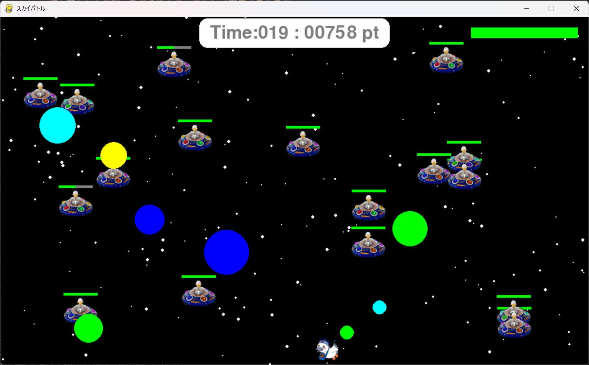

# スカイバトル

## 実行環境の必要条件
* python >= 3.10
* pygame >= 2.1
* マウス

## ゲームの概要
* 主人公キャラクター（コウカトン）をWASD操作を用いて敵を倒してポイントをためていくゲーム。
* 敵の球をよけながら撃墜をしてハイスコアを狙うゲーム。
* 参考URL：[大学Moodle](https://service.cloud.teu.ac.jp/moodle_epyc/course/view.php?id=18633)

## ゲームの遊び方
* WASD操作を用いて主人公キャラクターを敵を倒してポイントをためよう。
* マウスカーソルに向かって射撃でき、敵の球を撃ち落とすことができる。
* 時々現れる大打撃で高得点をねらおうね。
* "F"キーを押すことで回避行動ができるよ。
* 撃ち落とせない球もあるので回避を活用して玉をよけよう。
* 主人公キャラクターのHPが０になるとゲームオーバーとなるよ。
* 敵のHPを０にすると撃ち落とせるよ。

## ゲームの実装
### 共通基本機能
* 宇宙っぽい背景画像と主人公キャラクターの描画、敵キャラクターの描画
* WASDで操作する。
* 敵が主人公キャラクターをめがけて射撃をする。
* 敵を撃破したり敵の球を撃ち落とすと爆発する。

### 分担追加機能
* **宇宙っぽい背景（担当：仙波）**：背景として大きさの様々な星の背景を作成する機能。
* **必殺技カーソル（担当：仙波）**：タイミングよくスペースキーを押すと周辺にいる敵を倒す機能。
* **HPゲージ（担当：西ヶ谷）**：こうかとんと敵のHPをゲージで表示して残りHPに応じてゲージの色を変化させる機能。
* **回避(担当:服部)**:回避行動中に無敵状態になる機能。
* **マウスカーソルに向かって射撃(担当:服部)**:マウスカーソルに向かって射撃する機能。
* **爆弾区別（担当：小田）**：ビームで倒せる爆弾と倒せない爆弾の識別を行う機能。

### ToDo
- [ ] カメラ機能、主人公キャラクターを中心にする
- [ ] ステージ機能
- [ ] スタート画面
- [ ] アイテム要素
- [ ] ボーナス

### メモ
* bombクラスの引数を追加した。
